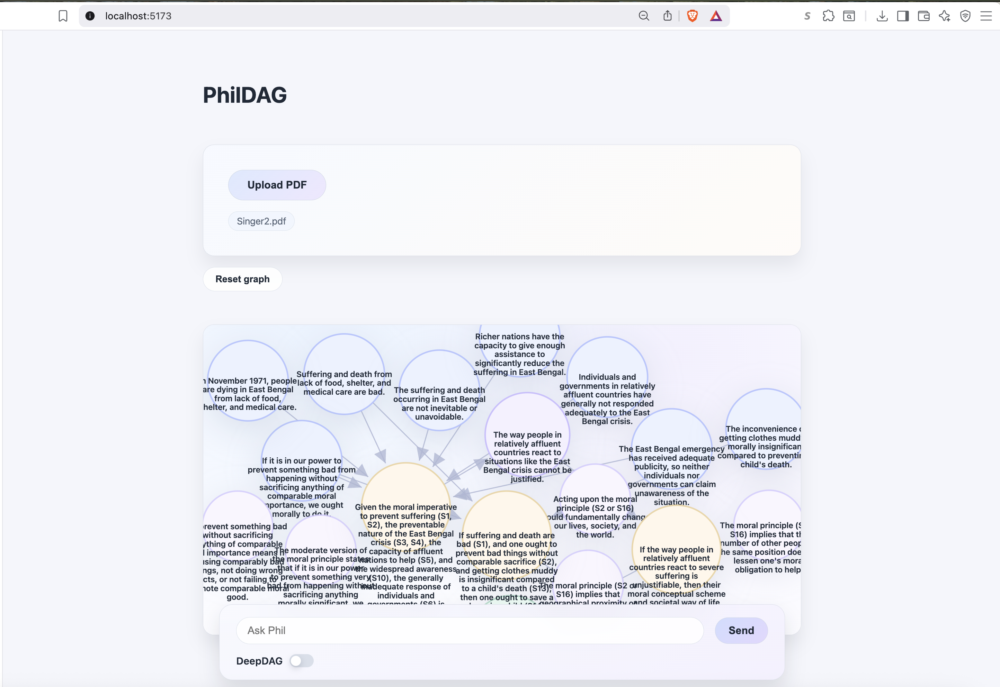
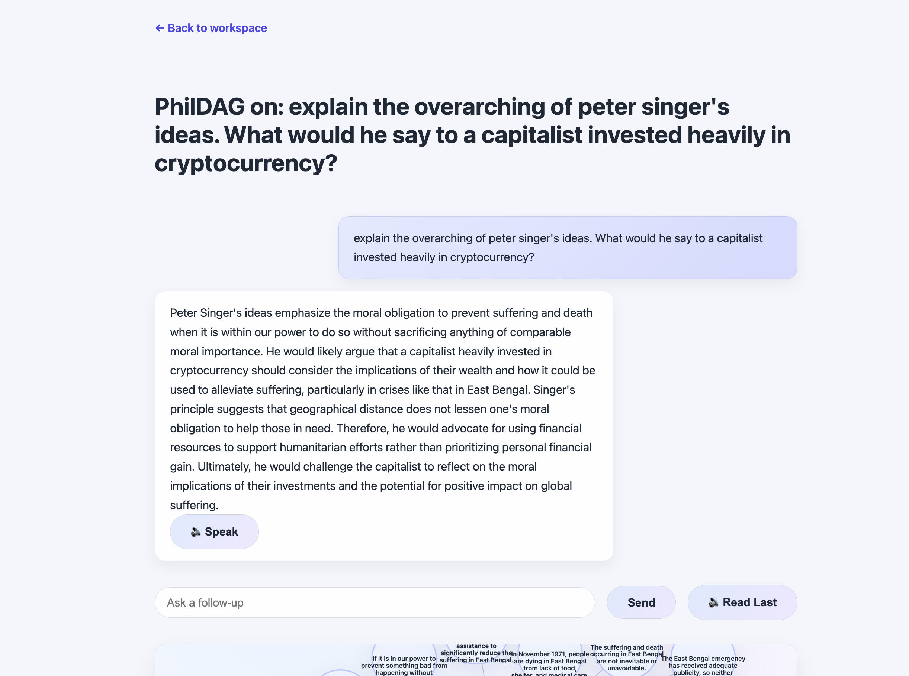

# PhilDAG

PhilDAG helps you upload philosophical PDFs, extract their argument graphs with Gemini, and chat with the resulting DAG in the browser.

## Screens





## Quick Start

```bash
# backend
uv run fastapi dev main.py

# frontend
cd frontend
npm install
npm run dev
```
